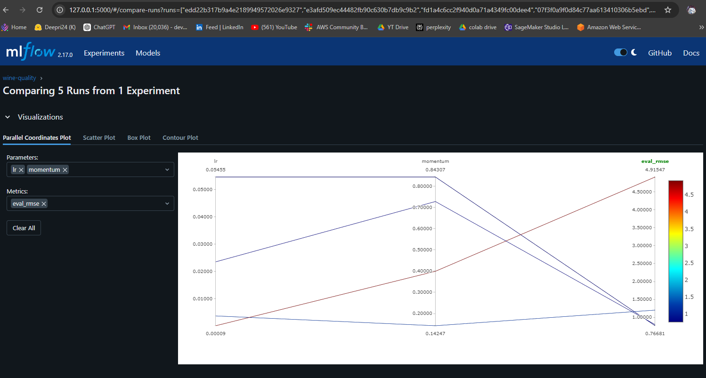
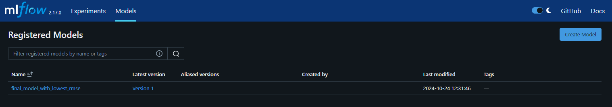

## ANN Model Building with MLFlow 

In this quickstart, you will:

- Run a hyperparameter sweep on a training script.
- Compare the results of the runs in the MLflow UI.
- Choose the best run and register it as a model.

## High-Level Steps

1. **Load the Dataset:**
   - Load the wine quality dataset from a public URL.

2. **Data Splitting:**
   - Split the data into training (75%) and test (25%) sets.
   - Further split the training data into training (80%) and validation (20%) sets.

3. **Preprocessing:**
   - Prepare the features and target variable for training.
   - Normalize the input features.

4. **Define and Train the Model:**
   - Define an Artificial Neural Network (ANN) model architecture.
   - Train the model using hyperparameters (learning rate and momentum) tracked by MLflow.

5. **Hyperparameter Tuning:**
   - Use Hyperopt for hyperparameter optimization.
   - Log parameters and evaluation metrics (RMSE) in MLflow.

6. **Model Validation:**
   - Validate the best model using example input and prepare it for deployment.

7. **Model Registration:**
   - Register the best-performing model in the MLflow model registry.

### To Start the MLflow UI:
- 'mlflow ui' 
- Access the UI at http://127.0.0.1:5000.

### Output snapshots 

-  RMSE measures the difference between the predicted values from your model and the actual target values (in this case, house prices). It is a commonly used metric to evaluate regression models.
- Lower RMSE indicates that your model's predictions are closer to the actual values, meaning your model is more accurate.
- Register the model with the lowest RMSE as the best performing model in MLFlow 
